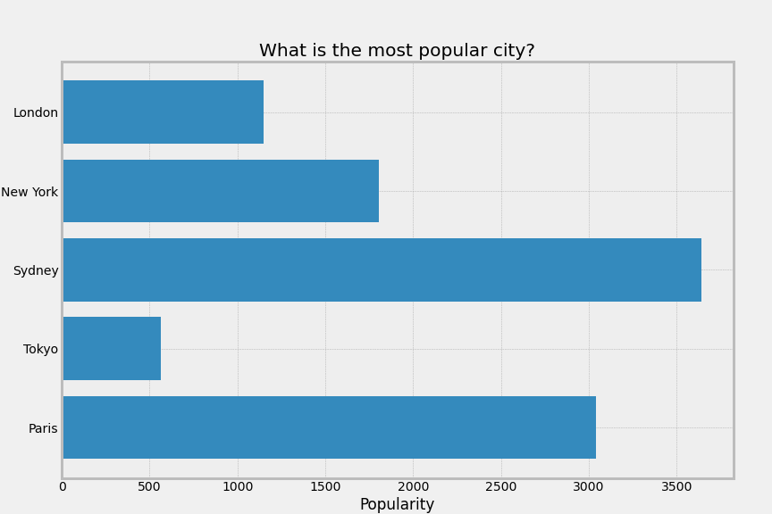
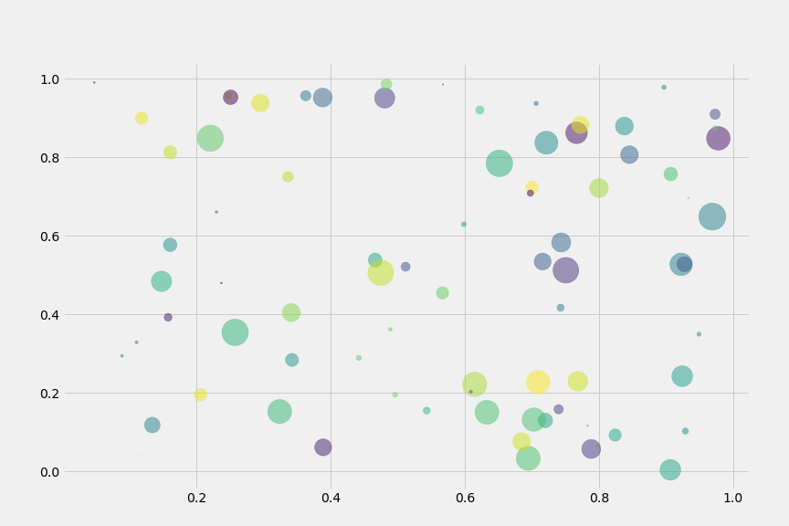
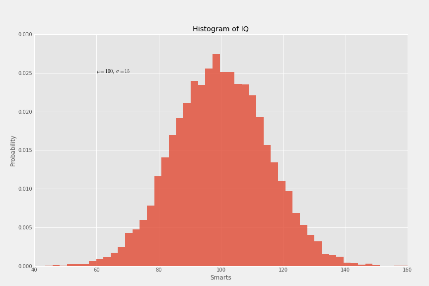
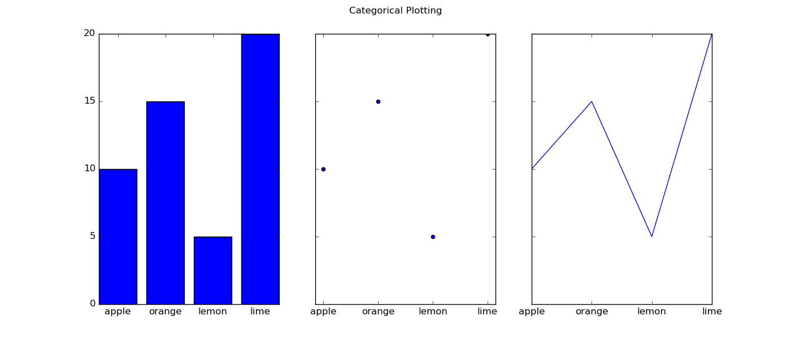
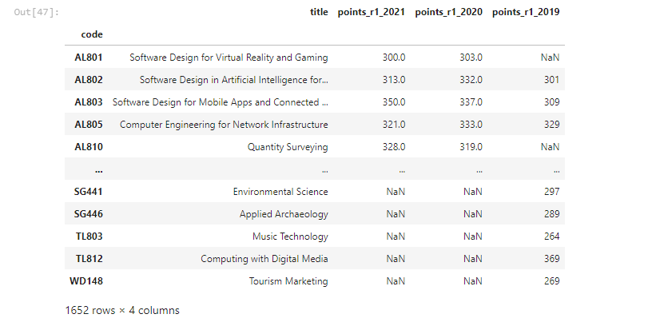
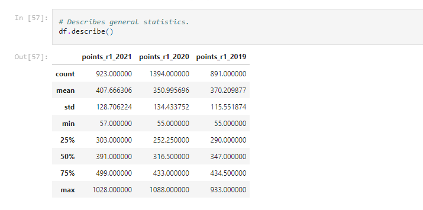
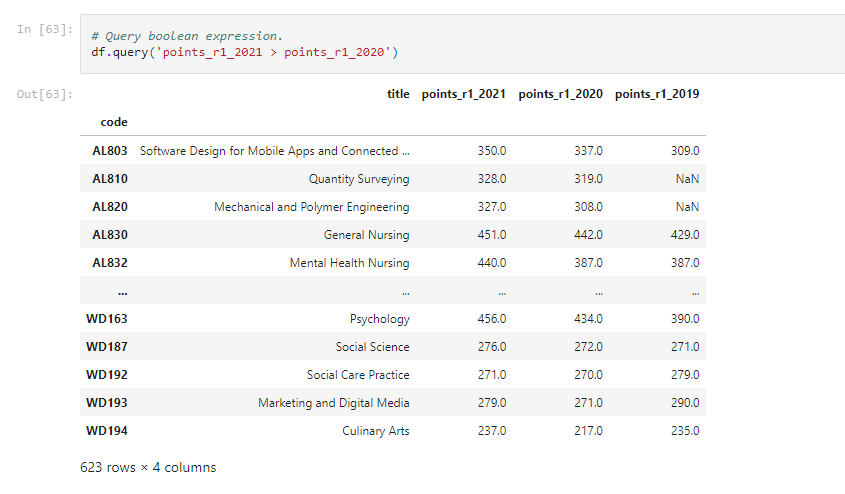
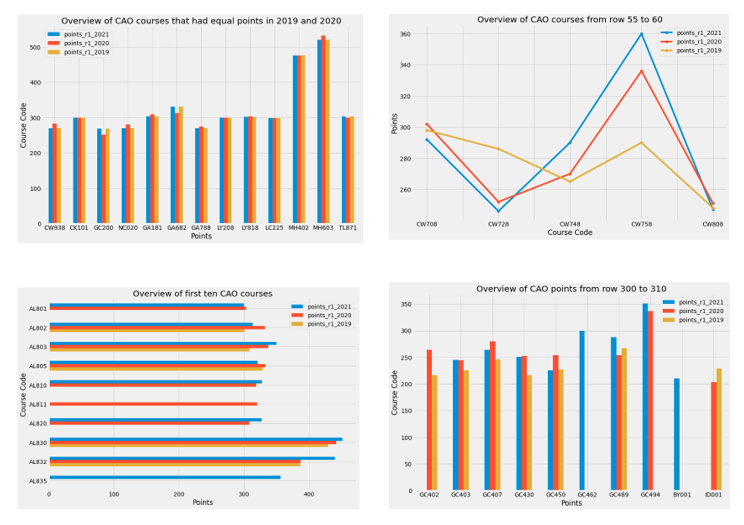

# Jupyter Notebooks

## Overview

This repository contains the following two jupyter notebooks as part of my project for 'Fundamental of Data Analysis' module:

1. `pyplot.ipynb` contains an overview of the matplotlib pyplot package in python and an in-depth explanation of three plots.

2. `cao.ipynb` explains how to load the CAO points information from the official website into dataframes using pandas and then compares the CAO points from 2019, 2020 and 2021.

 

## Quick Steps

### Install the following:

1. Download and install [anaconda]().
2. Download and install [cmder]() if on windows.

 

### How to run:

1. Open [cmder] terminal.
2. Run `jupyter lab` or `jupyter notebook`on the command line.
3. The notebook should automatically launch in your browser. 
4. If not, then you may need to temporarily disable security software as some internet security can interfere with jupyter. 
5. Or you can copy the http link in cmder and paste into the url box of your browser. 
6. Once jupyter is open in your browser select either notebook: `pyplot.ipynb` or `cao.ipynb` 
7. Once the notebook is open click on `kernal` on the tool bar and then `restart and run all`. 
8. Now the notebook is ready. 

 

### Requirements text file:
`requirements.txt` contains a list of all the python packages requried to import in order to run these notebooks. 

 

## Explore

### Pyplot Notebook

#### The Matplotlib Pyplot Package
Matplotlib pyplot is a state based interface used for data visualisation. It is a convenient way for users to generate high quality plots with minimal effort. Pyplot can define and store the current state using various commands and functions. This package has 137 functions that can be used for plotting. In order to demonstrate how pyplot works this notebook explains for following plots in detail. 

#### Horizontal Bar Plot
The example in the notebook uses numpy random to generate data for y-axis values. 

 

 

#### Scatter Plot
This scatter plot uses the numpy random function again to generate values for x and y. It also generates random color values while also producing random sizes for the markers. As shown here, there are various sizes and colors used in this plot while the alpha parameter allows for slight transparency.

 

 

#### Histogram
The histogram created in this notebook displays 10000 random values of mean and standard deviation in normal distribution. In other words, various mu and sigma values are passed into the argument as x and are plotted in a bell shaped curve.

 

 

#### Subplots
This function allows users to create one single figure with a set of subplots. The subplot in this notebook sets one row with three columns. The sharex parameter is set to true which allows the data to be shares on all axes. Then the axs and fig functions are used to call a bar plot at position 0, a scatter plot at position 1 and the plot function plots a y versus x line. These three subplots are displayed in a row with a figure subtitle as seen below. 

 

 

### 2. CAO Notebook

#### Convert points
This notebook takes cao points information from 2021, 2020 and 2019 and combines them into one dataframe for analysis. 

- 2021 points are converted from a http link into a csv file. Then regular expressions are used to extract particular information. 

- The 2020 points are converted from a excel spreadsheet into a csv file. Again this file had to be edited to remove unwanted preamble.

- The 2019 points are taken from a PDF and also converted into a csv file. This was done by first saving as a word document and then copying and pasting into VS Studio Code in order to edit.

#### Concat and join
The next step was concating and joining the courses and points for all 3 years. This is done by using the concat and join function in pandas. While doing this I removed any duplicate course names and used the course code as the index. Then I saved this new combined dataframe as a csv file. This file is then used for analysis. Here is an image of the dataframe created in this notebook.  

#### Analysis
An interesting note here was that when converting the 2019 cao points from a PDF to a csv file the data type was lost. This became apparent when attempting to analyse and plot the data. In order to rectify this issue I had to use the pandas to numeric function to convert the data back to it's numeric form. 

For the analysis I used the following pandas funcitons: head, tail, shape, size, describe, count, mean, std, min, max, query, loc and iloc. Then I used the matplotlib pyplot package to plot horizonal bar plot, bar plots and line plots in order to visualise the analysis. These can be seen in the images below.

 

 

 

## Credits
- For the pyplot notebook I heavily relied on the offical [matplotlib pyplot](https://matplotlib.org/stable/api/_as_gen/matplotlib.pyplot.html) documentation.

- For the cao notebook I heavely relied on my lecturer's notes and instruction when extracting and creating the dataframes. You can access his notebook [here](https://github.com/ianmcloughlin/cao-points/blob/main/cao-points-analysis.ipynb). I also relied on the offical [pandas](https://pandas.pydata.org/docs/user_guide/index.html#user-guide) documentation when analysising the data. 

- I also used the [geeksforgeeks](https://www.geeksforgeeks.org/) website when creating both notebooks. This website is user friendly and describes python methods and functions is a very clear and coherent way. I would highly recommend you google and read any of their blogs if you are new to progamming. 

 

## Badges

### NB viewer
You can view both notebooks on nbviewer by clicking on the following badge:

### Binder
You can view these notebooks on mybinder by clicking on this badge:

 

## Contact
If you have any queries or if you would like to contribute to this repository please contact me on the below link:

[Sarah McNelis](G00398343@gmit.ie)

 

## Issues
There were 2 major issues I came across when completing the cao notebook.

1. Error on server: the cao web server displayed the incorrect encoding standard. It was displayed as `iso-8859-1`. However, it became apparent that \x96 was used on one line which was referring to a fada. Therefore, I had to decode using `cp1252` which includes characters from the Latin alphabet. 

2. Dtypes: the next major issue I had was with my new dataframe which contains the cao points from 2021, 2020 and 2019. I couldn't understand why the data was not plotting correctly. The error that was thrown suggested that not all values were numeric. After checking the data type of the dataframe I discovered that the 2019 points had lost it's data type during the conversion from a PDF to a csv file. Therefore, the pandas to numeric function had to be used in order to return the data from an object to a float. 

 

## Conclusion
This readme contains a quick overview of the two notebooks in this repository. Pyplot protrays how to use matplotlb pyplot for data visualisation. This process was useful when completing my cao notebook. After extracting the cao points for analysis I used pyplot to aid with the plotting process. The cao notebook also shows users how to convert data from http, excel and PDF formats into csv files. Then it shows us how to combine 3 dataframes into 1. These skills are invaluable for data analysts as it presents data in an informative and constructive mannor.

 

## References

All references and code used in these notebooks have been sourced in Oct/Nov/Dec 2021 and cited at the end of each notebook. 

 

# End